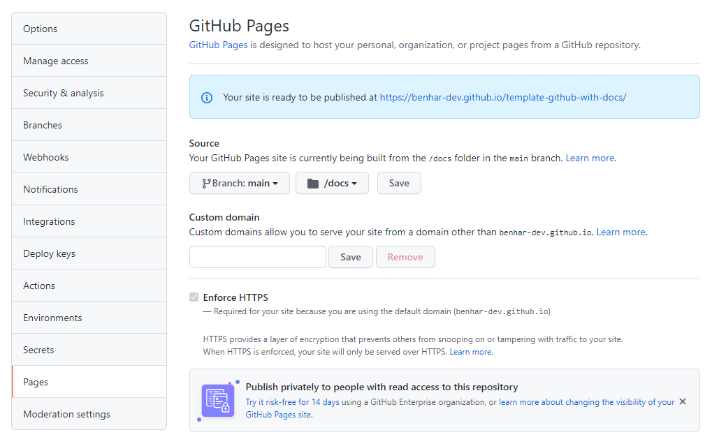

# Title goes here

## Disclaimer

This is a personal guide not a peer reviewed journal or a sponsored publication. We make
no representations as to accuracy, completeness, correctness, suitability, or validity of any
information and will not be liable for any errors, omissions, or delays in this information or any
losses injuries, or damages arising from its display or use. All information is provided on an as
is basis. It is the reader’s responsibility to verify their own facts.

The views and opinions expressed in this guide are those of the authors and do not
necessarily reflect the official policy or position of any other agency, organization, employer or
company. Assumptions made in the analysis are not reflective of the position of any entity
other than the author(s) and, since we are critically thinking human beings, these views are
always subject to change, revision, and rethinking at any time. Please do not hold us to them
in perpetuity.

## Overview

Overview goes here

## Screenshot


## Documentation
The documentation for this project can be found [here](https://benhar-dev.github.io/template-github-with-docs/). 

!!! Rememeber to enable pages on the repo settings, and to change the link above to the actual repo page !!!


To run the documentation locally you will need to have docsify installed
```
docsify init ./docs
```

Then serve the docs folder
```
docsify serve docs
```

## Code Snippets
Infomation about the code snippet goes here

```
PROGRAM MAIN
VAR
	// example
	foobar : STRING;
END_VAR
```

```
foobar := "HelloWorld";
```

## Versions

- TcXaeShell 3.1.4024.50

## Need more help?

Please visit http://beckhoff.com/ for further guides
